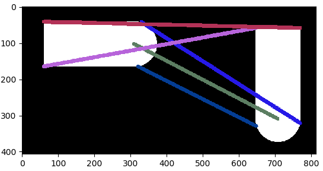
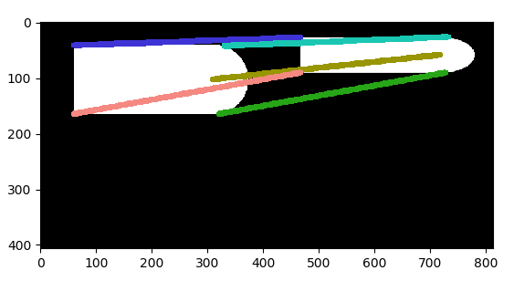
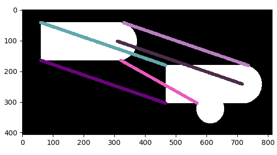
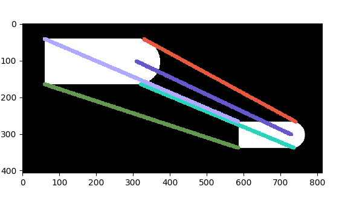
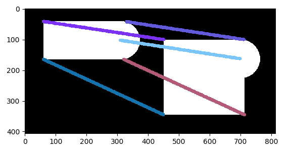

# 基于几何基元的匹配

 [轮廓分割具体方法](基于几何基元的匹配方法.pdf) 

## 一、轮廓提取

| 原图                                                         | 轮廓提取                                                     |
| ------------------------------------------------------------ | ------------------------------------------------------------ |
|  |  |

获取轮廓点集S={ (xi,yi) | i=1,2,3...m}

> Satoshi Suzuki and others. Topological structural analysis of digitized binary images by border following. *Computer Vision, Graphics, and Image Processing*, 30(1):32–46, 1985.

## 二、轮廓分割

| 多边形拟合                                                   | 轮廓分割                                                     |
| ------------------------------------------------------------ | ------------------------------------------------------------ |
|  |  |

将点集按照所属基元的不同分割为不同的子集。

领域长度大于阈值t的划分为线段

领域长度小于阈值t的划分为圆弧

## 三、基元拟合

对划分后的点集进行基元拟合（最小二乘法）得到几何基元
$$
C P=\left\{G F_{i} | i=1,2, \ldots, n\right\}
$$

CP为轮廓所表示的形状，由几何基元GFi组成。GF为线段和椭圆弧。
$$
G F_{i}=\left\{\begin{array}{ll}{L_{i},} & {i \in I_{1}} \\ {C_{i},} & {i \in I_{c}}\end{array}\right.
$$

## 四、基元匹配

匹配方法

形状CP1由m个基元GFi i=1,2,3,,,,m组成

形状CP2由m个基元GFj j=1,2,3,,,,n组成

对GFi,GFj所属两个形状所有基元进行归一化使得GFi=GFj，

计算CP1与CP2对应基元的cost，取cost最小的对应关系

线段间的cost为线段长度之差

线段与圆弧间的cost为圆弧的圆周角度数

圆弧与圆弧的cost为圆周角度数之差

|      | 模板                                                         | 目标                                                         |
| ---- | ------------------------------------------------------------ | ------------------------------------------------------------ |
| 图像 |  |  |

|      | 模板                                                         | 目标                                                         |
| ---- | ------------------------------------------------------------ | ------------------------------------------------------------ |
| 图像 |  |  |

|      | 模板                                                         | 目标                                                         |
| ---- | ------------------------------------------------------------ | ------------------------------------------------------------ |
| 图像 |  |  |

|      | 模板                                                         | 目标                                                         |
| ---- | ------------------------------------------------------------ | ------------------------------------------------------------ |
| 图像 |  |  |

|      | 模板                                                         | 目标                                                         |
| ---- | ------------------------------------------------------------ | ------------------------------------------------------------ |
| 图像 |  |  |

|      | 模板                                                         | 目标                                                         |
| ---- | ------------------------------------------------------------ | ------------------------------------------------------------ |
| 图像 |  |  |

## 存在的问题

1、匹配方法可以优化

2、算法的效果更依赖于轮廓分割的效果

